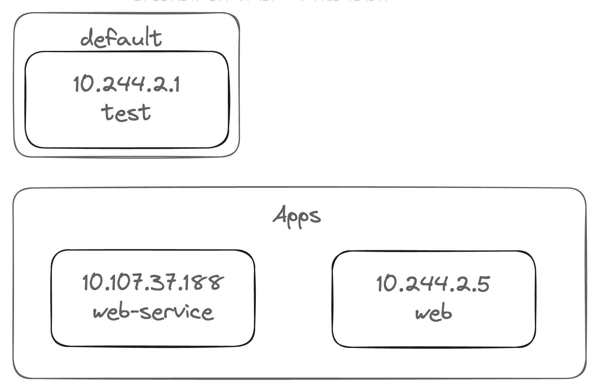

# Network

---

DNS 서버에 보내는 방법

`cat /etc/resolv.conf` 

nameserver 192.168.1.100

모르는 이름의 호스트를 마주치면 DNS 서버에서 이름을 가져오게 됨.

```yaml
ip link 

ip addr 

ip addr add 192.168.1.10/24 dev eth0

ip route

ip route add 192.168.1.10/24 via 192.168.2.1

arp

netstat -plnt
```

1. Create Network namespace
2. Create Bridge Network/Interface
3. Create vETH Pairs
4. Attach vETH to Namespace
5. Attach Other vETH to Bridge
6. Assign IP Address
7. Bring the Interface Up
8. Enable NAT -IP Masquerade

이 모든 일련의 과정을 `create Network Namespace` 로 통합하였다.

`bridge add <cid> <namespace>` 

## CNI (Container Network Interface)

컨테이너 런타임 환경에서 네트워킹 문제를 해결하기 위해 어떻게 개발되어야할지 정의하는 표준의 집합

### 실습

What is the network interface configured for cluster connectivity on the `controlplane` node?

node-to-node communication

then 

What is the MAC address assigned to `node01`?

```yaml
kubectl get nodes -o wide
> {ip 주소}

ip a | grep {ip 주소}
> 6254: eth0@if6255: <BROADCAST,MULTICAST,UP,LOWER_UP> mtu 1450 qdisc noqueue state UP group default 
    link/ether 02:42:c0:16:ad:09 brd ff:ff:ff:ff:ff:ff link-netnsid 0 # Mac 주소
    inet 192.22.173.9/24 brd 192.22.173.255 scope global eth0 #

ssh node01
같은 것 반복
```

## Pod Networking

net.script.sh

```bash
AS-IS 
# create Veth Pair
ip link add 

# Attach Veth Pair
ip link set ...
ip link set ...

# Assign IP Address
	# Invoke IPAM host-local plugin
	ip = get_free_ip_from_file() => /etc/cni/net.d/net-script.conf (아웃소싱 개념)
ip -n <namespace> addr add ..
ip -n <namespace> router add ..

# Bring it up Interface
ip -n <namespace> link set
```

겁나게 복잡한 일련의 과정을 CNI를 통해 다음의 한줄로 요약이 가능하다. 

`/etc/cni/net.d/net-script.conflist`  → `/opt/cni/bin/net-script.sh` → `./net-script.sh add <container> <namespace`

```bash
TO-BE
ip -n <namespace> link set ...

ip link del ...
```

## CNI in kubernetes

```bash
kubelet.service 
ps -aux | grep kubelet

--network-policy=cni
--cni-bin-dir=/opt/cni/bin
--cni-conf-dir=/etc/cni/net.d
```

### 실습

What is the POD IP address range configured by `weave`?
`ip addr show weave`

```yaml
kubectl logs -n kube-system weave-net-xx | grep ipalloc-range
```

## Service Networking

가상의 IP가 만들어지고 각 node에 ip를 배치하게 된다.

ClusterIP라고도 부른다.

`iptables -L -t nat | grep db-service` 

`cat /var/log/kube-proxy.log` 에서 

## DNS in kubernetes Cluster



| Hostname | Namespace | Type | Root | IP Address |
| --- | --- | --- | --- | --- |
| web-service | apps | svc | cluster.local | 10.107.37.188 |
| 10-244-2-5 | apps | pod | cluster.local | 10.244.2.5 |
|  |  |  |  |  |

`curl web-service.apps.svc.cluster.local`
`curl 10-244-2-5.apps.pod.cluster.local`