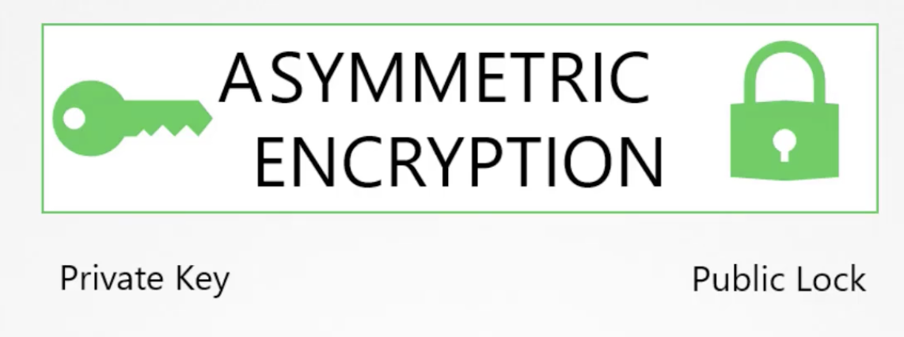

# Security

---

## Authenticate

kubernetes 인증 어떻게 이루어질까?

User → Kube-apiserver → Process 인데 Kube-apiserve에서 인증을 먼저 시도한다.

인증의 방식 4가지

1. static password file
    
    ```bash
    --basic-auth-file=user-details.csv
    ```
    
2. static token file
    
    ```bash
    --token-auth-file=user-details.csv
    ```
    
    - kube-apiserver.service를 살펴보면 다음의 옵션을 추가해주면 된다.
    - /etc/kubernetes/manifests/kube-apiserver.yaml 에 옵션을 추가할 수 있다.
    - 수정이 일어나게 되면 알아서 kube-apiserver가 재구동 된다.
    - 다음의 요청으로 api-server를 요청할 수 있다.
        
        ```bash
        curl -v -k https://~~~pods --header="Authorization : Bearer iuhsliugidfu" 
        ```
        
3. certificate
4. identity service

## TLS
비대칭 암호화 방식을 흔히 퍼블릭키와 프라이빗 키라고 얘기하는데 사실은 퍼블릭 잠금이 있을 뿐이다.
