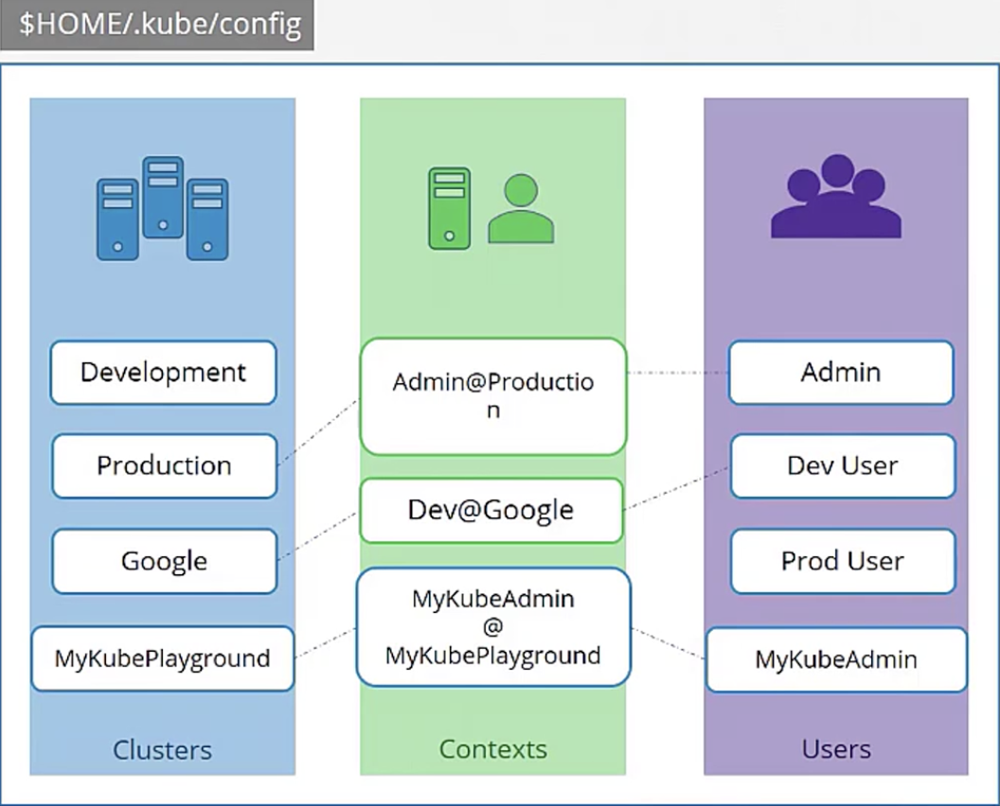

# Security

---

## Authenticate

kubernetes 인증 어떻게 이루어질까?

User → Kube-apiserver → Process 인데 Kube-apiserve에서 인증을 먼저 시도한다.

인증의 방식 4가지

1. static password file
    
    ```bash
    --basic-auth-file=user-details.csv
    ```
    
2. static token file
    
    ```bash
    --token-auth-file=user-details.csv
    ```
    
    - kube-apiserver.service를 살펴보면 다음의 옵션을 추가해주면 된다.
    - /etc/kubernetes/manifests/kube-apiserver.yaml 에 옵션을 추가할 수 있다.
    - 수정이 일어나게 되면 알아서 kube-apiserver가 재구동 된다.
    - 다음의 요청으로 api-server를 요청할 수 있다.
        
        ```bash
        curl -v -k https://~~~pods --header="Authorization : Bearer iuhsliugidfu" 
        ```
        
3. certificate
4. identity service

## TLS
비대칭 암호화 방식을 흔히 퍼블릭키와 프라이빗 키라고 얘기하는데 사실은 퍼블릭 잠금이 있을 뿐이다.


Public Lock = Publick Key 하는일: 암호화 *.crt, *pem server.crt, server.pem

Private Key 하는일 복호화 *.key, *-key.pem server.key, server-key.pem

```bash
# 내 환경에서 로그인 하기
	ssh-keygen
	# id_rsa(private key) id_rsa.pub(public Lock)
	
	cat ~/.ssh/authorized_keys
	# ssh-rsa AAdufhius user1
	
	ssh -i id_rsa user1@server1

# 다른 사용자가 내 환경에서 로그인 하기
cat ~/.ssh/authorized_keys

```

## TLS in K8s

### Client Certificates for Clients

Generate Keys - `openssl genrsa -out ca.key 2048`

Certificate Signing Request `openssl req -new -key ca.key -subj "/CN=KUBERNETES-CA" -out ca.csr`

Sign Certificates `openssl x509 -req -in ca.csr -signkey ca.key -out ca.crt`

Admin User

Generate Keys - `openssl genrsa -out admin.key 2048`

Certificate Signing Request `openssl req -new -key admin.key -subj "/CN=kube-admin" -out admin.csr`

Sign Certificates `openssl x509 -req -in admin.csr -CA ca.crt -CAKey ca.key -out admin.crt`

Kube Scheduler

Kube Proxy …

```bash
curl https://kube-apiserver:6443/api/v1/pods --key admin.key --cert admin.crt --cacert ca.crt

혹은
Kubeconfig 파일을 만든다.
```

### Server Certificates for Servers


클러스터 내의 모든 인증서 어떻게 설정됐는지 알아보자

### 실습

Identify the Certificate file used to authenticate `kube-apiserver` as a client to `ETCD` Server.

```bash
 --etcd-keyfile=/etc/kubernetes/pki/apiserver-etcd-client.crt
```

Identify the key used to authenticate `kubeapi-server` to the `kubelet` server.

```bash
--kubelet-client-key=/etc/kubernetes/pki/apiserver-kubelet-client.key
```

Identify the ETCD Server Certificate used to host ETCD server.

```bash
--cert-file=/etc/kubernetes/pki/etcd/server.crt
```

Identify the ETCD Server CA Root Certificate used to serve ETCD Server.

ETCD can have its own CA. So this may be a different CA certificate than the one used by kube-api server.

```bash
--trusted-ca-file=/etc/kubernetes/pki/etcd/ca.crt
```

What is the Common Name (CN) configured on the Kube API Server Certificate?

**OpenSSL Syntax:** `openssl x509 -in file-path.crt -text -noout`

How long, from the issued date, is the Root CA Certificate valid for?

File: `/etc/kubernetes/pki/ca.crt`

`openssl x509 -in /etc/kubernetes/pki/ca.crt -text -noout`

## Certificate API

1. Create CertificateSigningRequest Object
2. Review Request
3. Approve Request
4. Share Certs to User

`kubectl get csr`

`kubectl certificate approve jane`

```yaml
cat akshay.csr | base64 -w 0
<base64 csr content>
---
apiVersion: certificates.k8s.io/v1
kind: CertificateSigningRequest
metadata:
  name: akshay
spec:
  groups:
  - system:authenticated
  request: <Paste the base64 encoded value of the CSR file>
  signerName: kubernetes.io/kube-apiserver-client
  usages:
  - client auth
```

ontroller Manager에서 인증을 담당하고 있다. 

더 자세하게 들어가면

CSR-Approving

CSR Signing

```bash
kube-controller-manager.yaml

--cluster-signing-cert-file=/etc/kubernetes/pki/ca.crt
--cluster-signing-key-file=/etc/kubernetes/pki/ca.key
```

What is the Condition of the newly created Certificate Signing Request object?

`kubectl get csr`  

Approve the CSR Request

`kubectl certificate approve akshay`

deny the agnet-smith

`kubectl certificate deny agent-smith`

## KubeConfig


Kubeconfig는 3개로 이루어져 있다.

1. Clusters
2. Contexts
3. Users

우린 그동안 인증을 뒤에 붙여놓고  kube-apiserver에 명령을 내릴 수 있었다.

```yaml
kubectl get pods --server my-kube-cluster:443\
--client-key admin.key
--client-certificate admin.crt
--certificate-authority ca.crt
```

하지만 kubeconfig를 사용하면 뒤에 덕지덕지 붙은 옵션값들을 안 넣을 수 있다.

`$Home/.kube/config` 에있는 KubeConfig 파일을 읽는다.

kubeconfig로 다른 환경에 들어가고 싶을 때

```yaml
kubectl config view
kubectl config use-context prod-user@production 
kubectl config use-context context-name --kubeconfig /root/my-kube-config
```

## API Groups

kube api server와 다름 `/api` `/apis`에 포커싱을 한다.

`/version` : 쿠버네티스 버전을 살피기 위함

`/metrics` `/healthz` 상태를 모니터링 하기 위함

`/log` 로깅을 위함

`/api` : core group

`/apis` : API Group

`/apps`

`/v1` : Resources 

`/deployment`

`list` `get` `create` `delete`

`/replicasets`

`/statefulsets`

`/networking.k8s.io`

`/v1` : Resources 

`/networkpolicies`

`/authentication.k8s.io`

`/storage.k8s.io`

`/certificates.k8s.io`

`/v1` : Resources 

`/certificatesigningrequests`

```bash
curl http://localhost:6443 -k

curl http://localhost:6443/apis -k | grep "name"

```

## Authorization - 허가

create role 

```yaml
# kubectl get roles
apiVersion: rbac.authorization.k8s.io/v1
kind: Role
metadata:
	name: developer
rules: #(룰은 3가지로 이루어져있음)
- apiGroups: [""]
	resources: ["pods"]
	verbs: ["list", "get", "create", "update", "delete"]
- apiGroups: [""]
	resources: ["ConfigMap"]
	verbs: ["create"]
```

Role binding

```yaml
# kubectl get rolebindings
apiVersion: rbac.authorization.k8s.io/v1
kind: RoleBinding
metadata:
	name: devuser-developer-binding
subjects:
	- kind: User
		name: dev-user
		apiGroup: rbac.authorization.k8s.io
roleRef:
	kind: Role
	name: developer
	apiGroup: rbac.authorization.k8s.io
```

### Check Access

```bash
kubectl auth can-i create deployments --as devuser --namespace test
kubectl auth can-i delete nodes

```

### 권한을 이용해서 실행하기

`dev-user` 에게 네임스페이스 `blue 에서 create deployment` 권한이 있고, `create deployment`를 실행해라

```bash
kubectl --as dev-user create deployment nginx
```

## Cluster Role and Role Binding

Cluster Admin에서 `View Node` `delete Node` `delete Node` 의 권한을 줄 수 있다.

```yaml
get | watch | list  create | delete
```

## Service Account

계정엔 두개가 존재한다. User Account와 Service Account. 이전 내용들은 모두 user account에 관한 내용이었다. 하지만 이제부턴 시스템이 사용하는 service account를 다뤄볼 것이다. 대표적으로 prometheus, jenkins가 사용하는 계정이 있다.

만약 kube-apiserver를 통해 쿠버네티스 안의 pod등의 정보를 가져오는 service account 예시 또한 들 수 있다.

```yaml
# pod-definition.yaml
apiVersion: v1
kind: Pod
metadata:
	name:
spec:
	containers:
		- name: my-kubernetes-dashboard
			image: my-kubernetes-dashboard
	**serviceAccountName: dashboard-sa**
```

1. service account 계정 생성
2. Secret에 token 저장 해당 토큰은 https rest call 할 때, —header Bearer token `{token}`  으로 인증된다.

네임스페이스는 default가 기본이고 namespace 별로 다르게 생성할 수 잇다.

```bash
kubectl exec -it my-kubernetes-dashboard --ls /var/run/secrets/kubernetes.io/serviceaccount
```

service account의 권한은 kube-apiserver에 쿼리하는 정도의 제한된 권한만 가지고 있음.

### 실습 문제

The application needs a ServiceAccount with the Right permissions to be created to authenticate to Kubernetes. The `default` ServiceAccount has limited access. Create a new ServiceAccount named `dashboard-sa`.

```bash
# SA service account 위한 토큰 만들기
kubectl create token dashboadr-sa
```

You shouldn't have to copy and paste the token each time. The Dashboard application is programmed to read token from the secret mount location. However currently, the `default` service account is mounted. Update the deployment to use the newly created ServiceAccount

Edit the deployment to change ServiceAccount from `default` to `dashboard-sa`.

서비스 토큰을 마운트 시키기

```yaml
apiVersion: deployment
kind: Deployment
metadata: ...
spec:
	serviceAccountName: dashboard-sa
	containers: ...	
```

## Image Security

```bash
docker login private-registry.io

docker run private-registry.io/apps/internal-app

kubectl create secret docker-registry regcred \
	--docker-server=private-registry.io \
	--docker-username=registry-user \
	--docker-password=regisry-password \
	--docker-email=registry-user@org.com
```

```yaml
# pod-definition.yaml
apiVersion: v1
kind: Pod
metadata:
	name:
spec:
	containers:
		- name: nginx
			image: private-registry.io/apps/internal-app
		imagePullSecrets:
		- name: regcred
```

### 실습문제

Create a secret object with the credentials required to access the registry.

Name: `private-reg-cred`

Username: `dock_user`

Password: `dock_password`

Server: `myprivateregistry.com:5000`

Email: `dock_user@myprivateregistry.com`

```yaml
kubectl create secret docker-registry private-reg-cred --docker-server=myprivateregistry.com:5000 --docker-username=dock_user --docker-password=dock_password --docker-email=dock_user@myprivateregistry.com

kubectl create secret docker-registry private-reg-cred --docker-username=dock_user --docker-password=dock_password --docker-server=myprivateregistry.com:5000 --docker-email=dock_user@myprivateregistry.com
```

### Docker Security

컨테이너와 호스트가 같은 커널을 사용한다. 컨테이너는 리눅스에서 namespace에 의해 격리된다.

host와 container는 namespace가 존재한다. 결국 다른 PID로 격리되도록 한다.

만약 특정 컨테이너의 user가 root 사용자가 아니길 원한다면..?

`docker run --user=1000 ubuntu sleep 1000`  

```yaml
# pod 레벨에서 보안
apiVersion: v1
kind: Pod

spec:
  securityContext:
		runAsUser: 1000 # 1000번 사용자로 실행해라
	containers:
		image:
--------------
# container 레벨에서 보안
apiVersion: v1
kind: Pod

spec:
  securityContext:
		runAsUser: 1000 # 1000번 사용자로 실행해라
	containers:
		- image:
			securityContext:
				runAsUser: 1000 # 1000번 사용자로 실행해라
				capabilities:
					add: ["MAC_ADMIN"]
```

## Network Policy

Ingress(인입을 받는)와 Egress(밖으로 호출하는) 개념이 있다.

수행 :`Allow Ingress Traffic From API Pod on port 3306`

```yaml
# MYSQL DB Ingress (웹 Backend로 부터 인입을 받아야하는)
apiVersion: networking.k8s.io/v1
kind: NetworkPolicy
metadata:
	name:
spec: 
	podSelector:
		matchLabels:
			role: db
	policyTypes:
	- Ingress
	ingress:
	- from:
		- podSelector:
				matchLabels:
					name: api-pod
		ports:
		- protocol: TCP
			port: 3306	
```

### prod namespace내에서 잘 통신하고 있었는데, 만약 다른 namespace의 api-pod들이 접근하려고 하는데 이를 막으려면?

```yaml
# MYSQL DB Ingress (웹 Backend로 부터 인입을 받아야하는)
apiVersion: networking.k8s.io/v1
kind: NetworkPolicy
metadata:
	name:
spec: 
	podSelector:
		matchLabels:
			role: db
	policyTypes:
	- Ingress
	ingress:
	- from:
        # 특정 pod에게만 접근을 허용 # && 특정 Namespace에게만 접근을 허용
		- podSelector:
            matchLabels:
					name: api-pod
          namespaceSelector:
            matchLabels:
					name: prod
		- ipBlock:
				cidr: 192.168.5.10/32
		ports:
		- protocol: TCP
			port: 3306	
```


### depth (-)를 다르게 하여 조건을 변경할 수 있다.

```yaml
# MYSQL DB Ingress (웹 Backend로 부터 인입을 받아야하는)
apiVersion: networking.k8s.io/v1
kind: NetworkPolicy
metadata:
	name:
spec: 
	podSelector:
		matchLabels:
			role: db
	policyTypes:
	- Ingress
	ingress:
	- from:
        # 특정 pod에게만 접근을 허용 || 특정 Namespace에게만 접근을 허용
		- podSelector:
				matchLabels:
					name: api-pod
		- namespaceSelector:
				matchLabels:
					name: prod
		- ipBlock:
			cidr: 192.168.5.10/32
		ports:
		- protocol: TCP
			port: 3306	
```


```yaml
# MYSQL DB Ingress (웹 Backend로 부터 인입을 받아야하는)
apiVersion: networking.k8s.io/v1
kind: NetworkPolicy
metadata:
	name:
spec: 
	podSelector:
		matchLabels:
			role: db
	policyTypes:
	- Ingress
	- Egress
	ingress:
	- from:
        # 특정 pod에게만 접근을 허용 || 특정 Namespace에게만 접근을 허용
		- podSelector:
				matchLabels:
					name: api-pod
		ports:
		- protocol: TCP
			port: 3306	
	egress:
	- to: 
		- ipBlock:
				cidr: 192.168.5.10/32
		ports:
		- protocol: TCP
			port: 80
```

