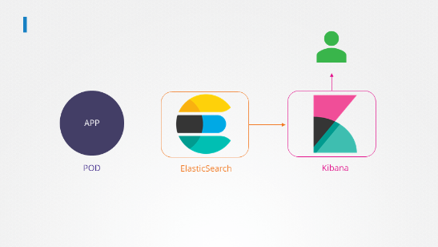

# Application Lifecycle Management

---

## Rolling update and Rollback

Revision 단위로 버전을 관리하여 업데이트와 롤백 버전을 관리하게 된다.

롤아웃 버전 알아보기

```bash
kubectl rollout status deployment/my-app-deplpoyment

kubectl rollout history deployment/my-app-deplpoyment
```

2가지 타입의 업데이트 전략이 존재함.

1. recreate
- 
1. rollingupdate


Deployment 안 Replica Set이 생기며, Pod 한개씩 대체되기 시작한다.

### Rollback

롤백을 하게 되면 오래전의 Replica Set을 불러오게 된다.

```bash
kubectl rollout undo deployment/my-app-deployment
```

Let us try that. Upgrade the application by setting the image on the deployment to `kodekloud/webapp-color:v2`

Do not delete and re-create the deployment. Only set the new image name for the existing deployment.

```bash
kubectl edit deployment frontend
# 후 버전을 바꾸면 된다.
```

Change the deployment strategy to `Recreate`

Delete and re-create the deployment if necessary. Only update the strategy type for the existing deployment.

```bash
kubectl edit deployment frontend
# 후 버전을 바꾸고 strategt를 Recreate로 변경해야함.
```

## Docker 환경 변수 넣기

Inspect the two files under directory `webapp-color-2`. What command is run at container startup?

Assume the image was created from the `Dockerfile` in this directory.

```yaml
controlplane ~/webapp-color-2 ➜  cat webapp-color-pod.yaml 
apiVersion: v1 
kind: Pod 
metadata:
  name: webapp-green
  labels:
      name: webapp-green 
spec:
  containers:
  - name: simple-webapp
    image: kodekloud/webapp-color
    command: ["--color","green"]

controlplane ~/webapp-color-2 ➜  cat Dockerfile
FROM python:3.6-alpine

RUN pip install flask

COPY . /opt/

EXPOSE 8080

WORKDIR /opt

ENTRYPOINT ["python", "app.py"]

CMD ["--color", "red"]
```

Inspect the two files under directory `webapp-color-3`. What command is run at container startup?

Assume the image was created from the `Dockerfile` in this directory.

```yaml
controlplane ~/webapp-color-3 ➜  cat Dockerfile 
FROM python:3.6-alpine
RUN pip install flask
COPY . /opt/
EXPOSE 8080
WORKDIR /op
ENTRYPOINT ["python", "app.py"]
CMD ["--color", "red"]

controlplane ~/webapp-color-3 ➜  cat webapp-color-pod-2.yaml 
apiVersion: v1 
kind: Pod 
metadata:
  name: webapp-green
  labels:
      name: webapp-green 
spec:
  containers:
  - name: simple-webapp
    image: kodekloud/webapp-color
    command: ["python", "app.py"]
    args: ["--color", "pink"]
```

## ConfigMap

pod의 env 변수 설정을 하게 도와준다. 보통 서버의 환경(검증,운영계), ~~ip주소 혹은 DB 계정정보(Secret 사용)~~를 지정해주면 좋을것이다. 

```yaml
# config-map.yaml
apiVersion: v1
kind: ConfigMap
metadata: 
	name: **app-config**
data:
  SERVER_ENV: prd
  POSTGRE_URL: 127.0.0.1:5432
```

다음과 같이 설정되있으면, pod definition때 ConfigMap을 삽입해보자면, configMapRef란 곳에 configMap을 여러개 삽입할 수 있게 한다.

```yaml
apiVersion: v1
kind: Pod
metadata:
  name: webapp
spec:
  containers:
  - name: webapp
    image: webapp
	  envFrom:
      - configMapRef:
        name: **app-config**
```

### 실습

env `APP_COLOR` 가 `green`  인 pod을 띄우시오

```yaml
apiVersion: v1
kind: Pod
metadata:
  name: webapp-color
  labels: 
    name: webapp-color

spec:
  containers:
    name: kodekloud/webapp-color
    image: webapp-color
  - env:
    - name: APP_COLOR
      value: green
```

How many `ConfigMaps` exists in the `default` namespace?

```bash
kubectl get ConfigMaps
```

## Secret

ConfigMap이 아닌 민감정보 DB 계정정보의 경우 Secret을 통해 저장한다. key value에서 base64로 인코딩된 값을로 저장한다.

```yaml
apiVersion: v1
kind: Secret
metadata:
  name: **app-secret**
data: 
  DB_HOST: cgjfDfg=
  DB_PASSWORD: cFghfi
```

echo -n ‘root’ | base64  라고 명령어를 치면 base64 인코딩된 값이 추출된다.

```yaml
apiVersion: v1
kind: Pod
metadata:
  name: webapp
spec:
  containers:
  - name: webapp
    image: webapp
	  envFrom:
      - secretRef:
        name: **app-secret**
```

## Encrypting Secret Data At Rest ← 먼소린지 모르겟..

```bash
apt-get install etcd-client

ls /etc/kubernetes/pki/etcd

ETCDCTL_API=3 etcdctl \
   --cacert=/etc/kubernetes/pki/etcd/ca.crt   \
   --cert=/etc/kubernetes/pki/etcd/server.crt \
   --key=/etc/kubernetes/pki/etcd/server.key  \
   get /registry/secrets/default/my-secret

ls /etc/kubernetes/manifests/
```

## Multi Container Pod



The application outputs logs to the file `/log/app.log`. View the logs and try to identify the user having issues with Login.

```bash
kubectl -n elastic-stack exec -it app -- cat /log/app.log
```

Edit the pod in the `elastic-stack` namespace to add a sidecar container to send logs to Elastic Search. Mount the log volume to the sidecar container.

Only add a new container. Do not modify anything else. Use the spec provided below.

> Note: State persistence concepts are discussed in detail later in this course. For now please make use of the below documentation link for updating the concerning pod.
> 

`https://kubernetes.io/docs/tasks/access-application-cluster/communicate-containers-same-pod-shared-volume/`

Requirements

- Name: app
- Container Name: sidecar
- Container Image: kodekloud/filebeat-configured
- Volume Mount: log-volume
- Mount Path: /var/log/event-simulator/
- Existing Container Name: app
- Existing Container Image: kodekloud/event-simulator

```yaml
---
apiVersion: v1
kind: Pod
metadata:
  name: app
  namespace: elastic-stack
  labels:
    name: app
spec:
  containers:
  - name: app
    image: kodekloud/event-simulator
    volumeMounts:
    - mountPath: /log
      name: log-volume

  - name: sidecar
    image: kodekloud/filebeat-configured
    volumeMounts:
    - mountPath: /var/log/event-simulator/
      name: log-volume

  volumes:
  - name: log-volume
    hostPath:
      # directory location on host
      path: /var/log/webapp
      # this field is optional
      type: DirectoryOrCreate
```
## Init Container

**`initContainers`의 역할**: 때로는 팟이 시작할 때만 필요한 일시적 작업이 있습니다. 이런 작업을 위해 **`initContainers`**를 사용합니다. 이 컨테이너들은 메인 애플리케이션이 시작하기 전에 필요한 사전 작업(예: 필요한 코드를 끌어오거나 외부 서비스의 가용성 확인)을 수행합니다.

상황: orange pod의 issue를 fix 하시오
```bash
# 무슨 일인지 살펴보자
kubectl describe pod orange

# 로그를 살펴보자
kubectl logs orange
kubectl logs orange -c init-myservice
```